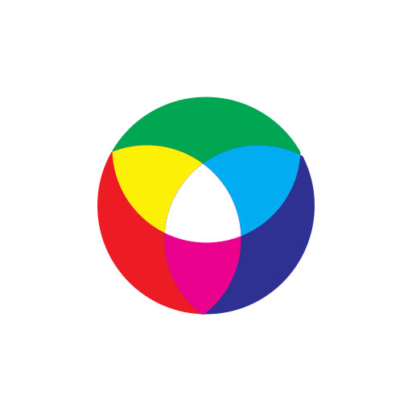

<div align="center">
  

  # @hanzo/logo

  Official Hanzo logo package providing TypeScript/React components and utilities for consistent branding across the Hanzo ecosystem.

  [](https://www.npmjs.com/package/@hanzo/logo)
  [](https://opensource.org/licenses/MIT)
  [](https://www.typescriptlang.org/)
</div>

## Logo Showcase

<div align="center">
  <table>
    <tr>
      <th colspan="5">Hanzo Logo - Multiple Sizes</th>
    </tr>
    <tr>
      <td align="center">
        <br>
        <sub>32×32</sub>
      </td>
      <td align="center">
        <br>
        <sub>64×64</sub>
      </td>
      <td align="center">
        <br>
        <sub>128×128</sub>
      </td>
      <td align="center">
        <br>
        <sub>256×256</sub>
      </td>
      <td align="center">
        <br>
        <sub>512×512</sub>
      </td>
    </tr>
  </table>

  <table>
    <tr>
      <th>macOS Dock Icon</th>
      <th>Monochrome</th>
      <th>Menu Bar Icon</th>
    </tr>
    <tr>
      <td align="center">
        <br>
        <sub>Rounded corners + black background</sub>
      </td>
      <td align="center">
        <br>
        <sub>For single color displays</sub>
      </td>
      <td align="center">
        <br>
        <sub>Optimized for menu bars</sub>
      </td>
    </tr>
  </table>
</div>

## Features

- 🎨 **SVG Logo Generation** - Programmatically generate Hanzo logos in multiple formats
- ⚛️ **React Components** - Ready-to-use React components with TypeScript support
- 🎯 **Multiple Variants** - Color, monochrome, and menu bar optimized versions
- 📦 **Icon Generation** - Generate icons in all required sizes for web and desktop apps
- 🖥️ **Platform Icons** - macOS dock icons, menu bar icons, and favicons
- 🔧 **TypeScript Native** - Full TypeScript support with proper type definitions

## Installation

```bash
npm install @hanzo/logo
# or
yarn add @hanzo/logo
# or
pnpm add @hanzo/logo
```

## Quick Start

### React Component

```tsx
import { HanzoLogo } from '@hanzo/logo/react';

<HanzoLogo size={128} />
<HanzoLogo variant="mono" size={64} />
<HanzoLogo variant="white" className="w-16 h-16" />
```

### SVG Generation

```ts
import { getColorSVG, getMonoSVG, getWhiteSVG } from '@hanzo/logo';

const colorLogo = getColorSVG();
const monoLogo = getMonoSVG();
const whiteLogo = getWhiteSVG();
```

### Icon Generation

```ts
import { generateIcon, getColorSVGCropped } from '@hanzo/logo';

// Generate macOS dock icon
const svg = getColorSVGCropped();
await generateIcon(svg, 'dock-icon.png', 512, true);
```

## License

MIT © Hanzo AI

## Support

For issues, questions, or suggestions, visit [GitHub Issues](https://github.com/hanzoai/hanzo-logo/issues)