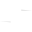
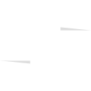
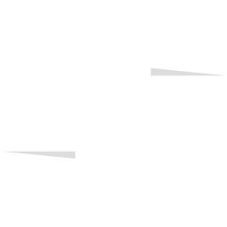
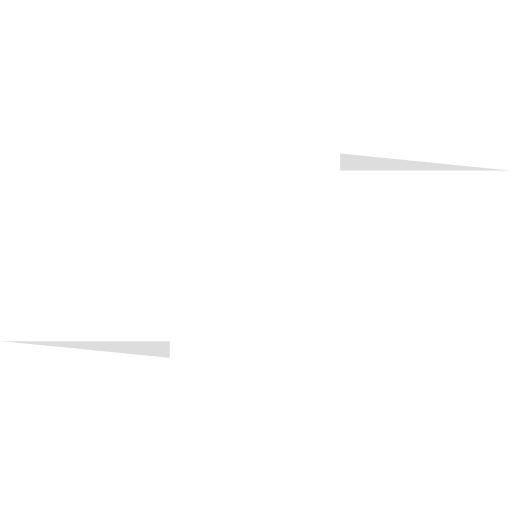

<div align="center">
  

  # @zooai/logo

  Official Zoo logo package providing TypeScript/React components and utilities for consistent branding across the Zoo ecosystem.

  [](https://www.npmjs.com/package/@zooai/logo)
  [](https://opensource.org/licenses/MIT)
  [](https://www.typescriptlang.org/)
</div>

## Logo Showcase

<div align="center">
  <table>
    <tr>
      <th colspan="5">Color Logo - Multiple Sizes</th>
    </tr>
    <tr>
      <td align="center">
        <br>
        <sub>32×32</sub>
      </td>
      <td align="center">
        <br>
        <sub>64×64</sub>
      </td>
      <td align="center">
        <br>
        <sub>128×128</sub>
      </td>
      <td align="center">
        <br>
        <sub>256×256</sub>
      </td>
      <td align="center">
        <br>
        <sub>512×512</sub>
      </td>
    </tr>
  </table>

  <table>
    <tr>
      <th>macOS Dock Icon</th>
      <th>Monochrome</th>
      <th>Menu Bar Icon</th>
    </tr>
    <tr>
      <td align="center">
        <br>
        <sub>Rounded corners + black background</sub>
      </td>
      <td align="center">
        <br>
        <sub>For single color displays</sub>
      </td>
      <td align="center">
        <br>
        <sub>Optimized for menu bars</sub>
      </td>
    </tr>
  </table>
</div>

## Features

- 🎨 **SVG Logo Generation** - Programmatically generate Zoo logos in multiple formats
- ⚛️ **React Components** - Ready-to-use React components with TypeScript support
- 🎯 **Multiple Variants** - Color, monochrome, and menu bar optimized versions
- 📦 **Icon Generation** - Generate icons in all required sizes for web and desktop apps
- 🔧 **TypeScript Native** - Full TypeScript support with proper type definitions

## Installation

```bash
npm install @zooai/logo
# or
yarn add @zooai/logo
# or
pnpm add @zooai/logo
```

## Usage Examples

### 🎨 Standard Color Logo

```tsx
import { ZooLogo } from '@zooai/logo/react';
import { getColorSVG, getColorSVGCropped } from '@zooai/logo';

// React component - auto sizing
<ZooLogo size={128} />

// Get tightly cropped version (no extra padding)
const croppedSVG = getColorSVGCropped();

// Use in various sizes
<ZooLogo size={32} />   // Favicon size
<ZooLogo size={64} />   // Small icon
<ZooLogo size={128} />  // Standard icon
<ZooLogo size={256} />  // Large display
```

### 🖥️ macOS Dock Icon

```tsx
import { generateIcon } from '@zooai/logo';
import { getColorSVGCropped } from '@zooai/logo';

// Generate macOS dock icon with black rounded background
const svgString = getColorSVGCropped();
await generateIcon(svgString, 'dock-icon.png', 512, true); // true = add background

// The icon will have:
// - Rounded corners (22% radius)
// - Black background
// - 80% logo size with 10% padding on each side
```

### 📊 Menu Bar Icon

```tsx
import { ZooLogo } from '@zooai/logo/react';
import { getMenuBarSVG } from '@zooai/logo';

// React component for menu bar
<ZooLogo variant="mono" size={16} />  // macOS menu bar
<ZooLogo variant="mono" size={24} />  // @1.5x
<ZooLogo variant="mono" size={32} />  // @2x

// Get tightly cropped menu bar SVG
const menuBarSVG = getMenuBarSVG();
// This version is optimized for small sizes with thicker strokes
```

### ⚫ Monochrome Variants

```tsx
import { ZooLogo } from '@zooai/logo/react';
import { getMonoSVG, getWhiteSVG } from '@zooai/logo';

// Black outline (for light backgrounds)
<ZooLogo variant="mono" size={128} />
const monoSVG = getMonoSVG();

// White outline (for dark backgrounds)
<ZooLogo variant="white" size={128} />
const whiteSVG = getWhiteSVG();
```

### 📦 Batch Icon Generation

```ts
import { generateIcon, getColorSVGCropped, getMonoSVG } from '@zooai/logo';

// Generate all app icons
const sizes = [16, 32, 64, 128, 256, 512, 1024];
const colorSVG = getColorSVGCropped();

for (const size of sizes) {
  // Regular icons
  await generateIcon(colorSVG, `icon-${size}.png`, size);

  // macOS dock icons (128px and up get background)
  if (size >= 128) {
    await generateIcon(colorSVG, `icon-macos-${size}.png`, size, true);
  }
}

// Generate menu bar icons
const menuBarSVG = getMenuBarSVG();
await generateIcon(menuBarSVG, 'menubar-16.png', 16);
await generateIcon(menuBarSVG, 'menubar-32.png', 32);
```

### 🌐 Web Favicon

```tsx
import { ZooFavicon } from '@zooai/logo/react';
import { zooLogoDataUrl } from '@zooai/logo';

// React component (adds to document head)
<ZooFavicon />

// Manual favicon
<link rel="icon" href={zooLogoDataUrl} />
<link rel="icon" type="image/svg+xml" href="/logo.svg" />
<link rel="apple-touch-icon" href="/logo-180.png" />
```

### 🎯 Data URLs and Base64

```ts
import { getLogoDataUrl, getLogoBase64 } from '@zooai/logo';

// Get as data URL (ready to use in img src)
const dataUrl = getLogoDataUrl({ variant: 'color' });
const monoDataUrl = getLogoDataUrl({ variant: 'mono' });

// Get as base64 (for APIs that need base64)
const base64 = getLogoBase64({ variant: 'color' });

// Use in CSS
const style = {
  backgroundImage: `url(${dataUrl})`,
  backgroundSize: 'contain',
  backgroundRepeat: 'no-repeat'
};
```

## Building Icons

The package includes a build script for generating all icon variations:

```bash
# Using npm scripts
npm run generate

# Using Make
make generate

# Generate and preview
make preview
```

## Development

### Quick Start

```bash
# Install dependencies
make install

# Build TypeScript
make build

# Run tests
make test

# Generate icons
make generate
```

### Available Make Commands

```bash
make help         # Show all available commands
make install      # Install dependencies
make build        # Build TypeScript files
make clean        # Remove build artifacts
make dev          # Development mode with watch
make test         # Run tests
make lint         # Run ESLint
make format       # Format with Prettier
make typecheck    # TypeScript type checking
make generate     # Generate all logo variations
make preview      # Preview generated logos
make publish      # Publish to npm
```

### Project Structure

```
@zooai/logo/
├── src/
│   ├── index.ts       # Main exports
│   ├── logos.ts       # Logo generation logic
│   ├── generator.ts   # Icon generation utilities
│   ├── react.tsx      # React components
│   ├── types.ts       # TypeScript definitions
│   └── build.ts       # CLI build script
├── dist/              # Built JavaScript files
├── Makefile           # Build automation
├── package.json       # Package configuration
└── tsconfig.json      # TypeScript configuration
```

## Logo Specifications

The Zoo logo consists of three overlapping circles forming a Venn diagram pattern:

### Primary Colors
- **Green Circle**: `#00A652` (RGB: 0, 166, 82) - Top
- **Red Circle**: `#ED1C24` (RGB: 237, 28, 36) - Bottom left
- **Blue Circle**: `#2E3192` (RGB: 46, 49, 146) - Bottom right

### Secondary Colors (Overlaps)
- **Yellow**: `#FCF006` (Green + Red)
- **Cyan**: `#01ACF1` (Green + Blue)
- **Magenta**: `#EA018E` (Red + Blue)
- **White**: `#FFFFFF` (All three)

### Dimensions
- **Standard**: 1024×1024px canvas
- **Circle Radius**: 234px
- **Outer Boundary**: 270px radius
- **Menu Bar**: Optimized stroke width for visibility at 16px

## API Reference

### Functions

#### `generateColorSVG(): string`
Generates the full-color Zoo logo as an SVG string.

#### `generateMonoSVG(): string`
Generates a monochrome version suitable for single-color displays.

#### `generateMenuBarSVG(): string`
Generates a tightly-cropped version optimized for menu bars.

#### `generateIcon(svg: string, path: string, size: number, background?: boolean): Promise<void>`
Generates a PNG icon from an SVG string.

### React Components

#### `<ZooLogo />`
Props:
- `size?: number` - Icon size in pixels (default: 128)
- `variant?: 'color' | 'mono' | 'white'` - Logo variant (default: 'color')
- `style?: React.CSSProperties` - Additional styles
- `className?: string` - CSS class name

#### `<ZooFavicon />`
Adds appropriate favicon link tags to the document head.

## License

MIT © Zoo AI

## Contributing

Contributions are welcome! Please ensure:
1. All TypeScript files pass type checking
2. Code is formatted with Prettier
3. New features include appropriate tests
4. Documentation is updated accordingly

## Support

For issues or questions, please visit [GitHub Issues](https://github.com/zooai/logo/issues).